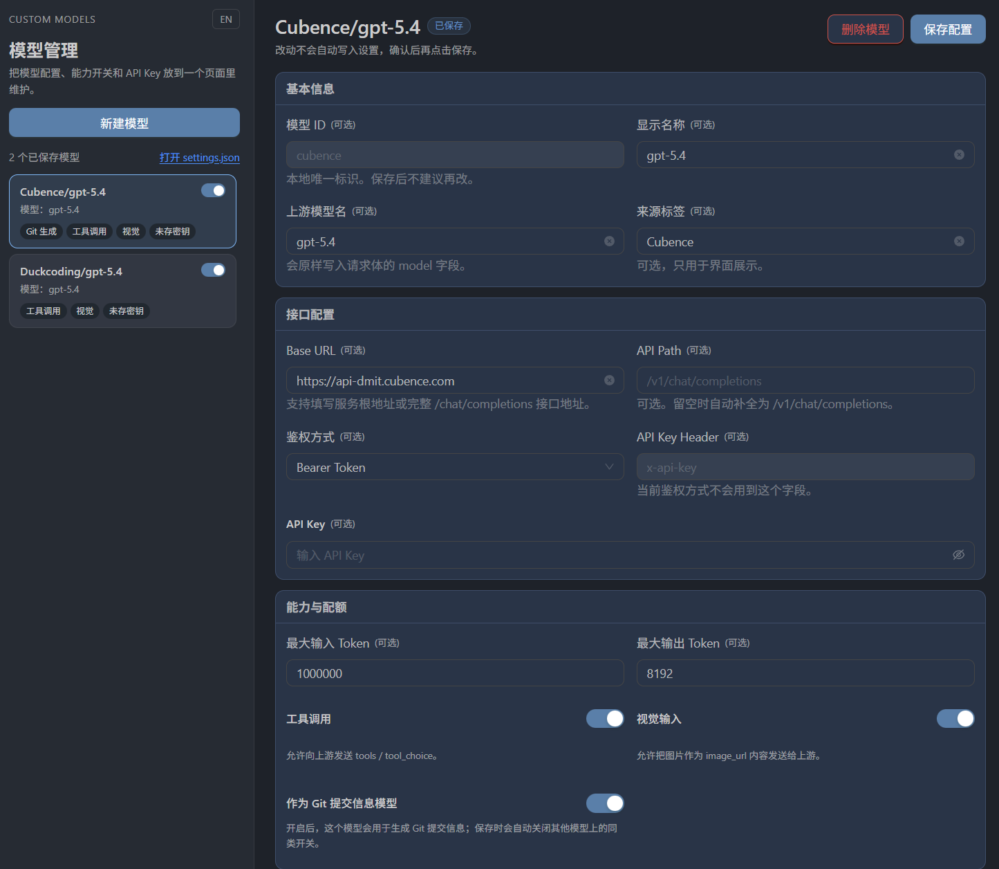

**中文** | [English](./README_en.md)

# VS Code Copilot 自定义模型插件

VS Code 的 Copilot 免费额度太少了，这个插件可以新增自定义模型。

- 安装插件后，底部状态栏有一个Models按钮，点击后可以打开管理页面。
- 目前只兼容 OpenAI Chat Completions 协议的第三方模型服务。
- 启用【作为 Git 提交信息模型】之后，生成 Git 提交信息按钮也会有两个选项，一个是 Copilot，一个是由插件提供功能。

